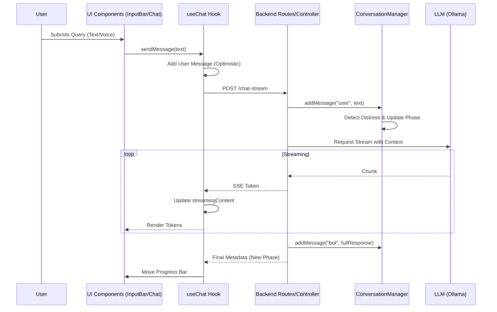

# Sakoon Project: Detailed Codebase Analysis (REVISED)

## 1. Project Overview
**Sakoon** is a specialized mental health and stress-management AI platform designed specifically for the Pakistani audience. Its primary differentiator is its "Street Smart" persona that communicates exclusively in **Roman Urdu** (Urdu written in the Latin alphabet), providing a relatable and empathetic "friend-like" experience.

### Core Technology Stack
- **Frontend**: React (Vite) with Tailwind CSS and GSAP animations.
- **Backend**: Node.js & Express.
- **Database**: SQLite (managed via `better-sqlite3`).
- **Intelligence**: Integrated with **Ollama** (running Gemma 2) for localized, low-latency AI responses.
- **Voice**: Web Speech API for Urdu recognition + custom transliteration logic.

---

## 2. Advanced Query-to-Response Flow Analysis

### A. State Orchestration (The Hook Layer)
The entire chat experience is driven by the `useChat.js` hook. 
- It maintains the `messages` array, `currentPhase`, and `streamingContent`.
- When `sendMessage` is called, it performs an **Optimistic Update** (adding the user message immediately) before calling the API.
- It handles the **Streaming Buffer**, appending tokens to `streamingContent` as they arrive from the backend.

### B. Phase & Logic Management (The Service Layer)
The backend doesn't just pass messages to the AI; it actively manages the conversation's emotional depth via `conversationManager.js`.
- **Distress Detection**: Scans user input for keywords like "tension", "pareshan", or "akela".
- **Phase Transition**: 
    - **EXPLORE**: Initial phase (Social/Listening).
    - **UNDERSTAND**: Triggered after ~3-4 turns if distress is detected.
    - **SUGGEST**: Final phase where the AI provides practical advice.
- **Confusion Buffer**: If a user says "Pata nahi", the system stays in the EXPLORE phase longer to provide more support.

### C. Voice Query Lifecycle
1. **Recording**: `InputBar.jsx` uses `webkitSpeechRecognition` (ur-PK).
2. **Real-time Mapping**: A local dictionary instantly converts Arabic script to Roman Urdu in the UI.
3. **LLM Polish**: Upon completion, `api.transliterate` calls the backend, which uses the LLM to refine the Roman Urdu spelling.

---

## 3. Revised Flowchart

---

## 4. Complete File Breakdown

| File Name | Responsibility |
| :--- | :--- |
| **`useChat.js`** | **Primary Controller**. Manages the state, streaming logic, and optimistic UI updates for the entire frontend. |
| **`conversationManager.js`** | **Business Logic**. Handles distress detection, phase transitions (Explore/Understand/Suggest), and history trimming. |
| **`server.js`** | **Entry Point**. Configures Express, CORS, and performs the "Model Warmup" to ensure fast first-responses. |
| **`InputBar.jsx`** | **Input Gateway**. Handles voice recording, local transliteration mapping, and text submission. |
| **`promptBuilder.js`** | **Context Engine**. Injects the Roman Urdu rules and formats the history payload for the LLM. |
| **`api.js`** | **Communication Layer**. Low-level fetch calls, including SSE (Server-Sent Events) management. |
| **`ChatWindow.jsx`** | **Visual Orchestrator**. Manages auto-scrolling, quick prompts, and rendering the message list. |
| **`PhaseIndicator.jsx`** | **Status UI**. Displays the current conversation stage (Listening/Understanding/Helping) to the user. |
| **`DynamicLoader.jsx`** | **Thinking UI**. Shows animated "Thinking" messages and pulsing dots while the AI is processing. |
| **`llmCaller.js`** | **AI Interface**. Communicates directly with the local Ollama instance and streams response buffers. |
| **`db.js`** | **Persistence Layer**. Handles SQLite operations for conversations, messages, and mood logs. |
| **`logger.js`** | **Traceability**. Provides timestamped logs for debugging the prompt building and state changes. |

---

## 5. Summary of Functionality
The system is more than just a chatbot; it is a **reasoning engine** that:
1.  **Ensures Cultural Alignment**: Prohibits Hindi and English loanwords to sound like a local Pakistani friend.
2.  **Manages Emotional Depth**: Dynamically shifts its behavior based on user distress levels.
3.  **Prioritizes Performance**: Uses local character mapping for instant voice feedback and model warmup for zero-lag starts.

---
*Generated by Antigravity Analysis Hub (Version 2.0)*
